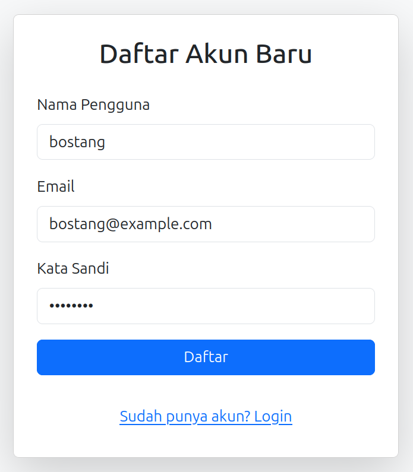
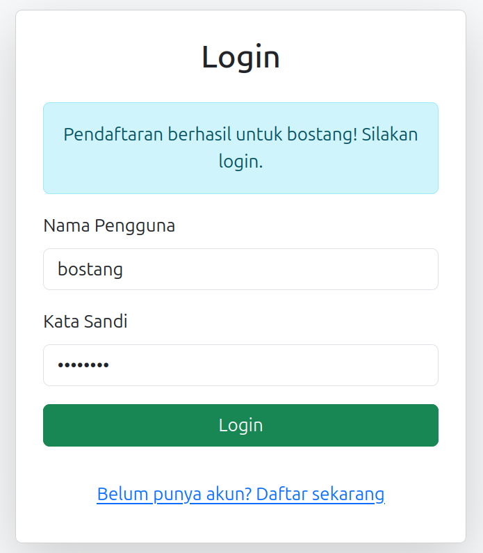
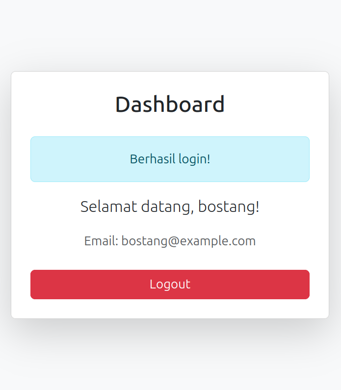
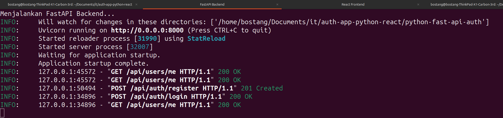

# Authentication App using Python (FastAPI) & React.js

Sebuah parent repository untuk aplikasi sederhana (frontend + backend) untuk autentikasi (register + login) menggunakan React.js untuk frontend dan juga Python FastAPI untuk backend.

## Cara Menjalankan

### Otomatis

> script untuk instalasi aplikasi (frontend, backend) yaitu `init.sh` dan menjalankan aplikasi secara otomatis `run.sh` telah disipakan.

```bash
# lakukan sekali saja untuk menginstall library & dependency frontend dan backend
./init.sh

# untuk menjalankan aplikasi
./run.sh

# akses frontend
```

### Manual

- **Backend**
  - pindah ke direktori `python-fast-api-auth`
  - lakukan `pip install -r requirements.txt`
  - lakukan `uvicorn main:app --reload`
- **Frontend**
  - pindah ke direktori `react-frontend-auth`
  - lakukan `npm install`
  - lakukan `npm start`

## Demonstrasi

- register :



- login:



- dashboard setelah login



- tampilan log di backend:



## Menambahkan submodul

> lakukan ketika belum ada `.gitmodules`

```bash
# menambahkan submodul frontend
git submodule add https://github.com/bostang/react-frontend-auth.git react-frontend-auth

# menambahkan submodul backend
git submodule add https://github.com/bostang/python-fast-api-auth.git python-fast-api-auth

# untuk memperbarui submodul apabila ada perubahan
git submodule update --init --recursive
```
