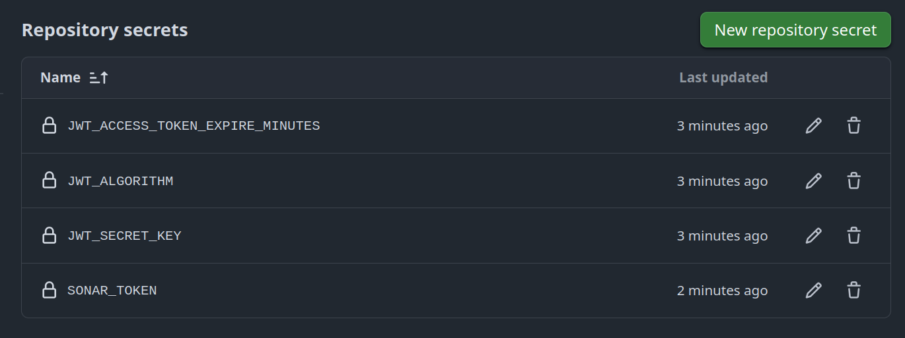
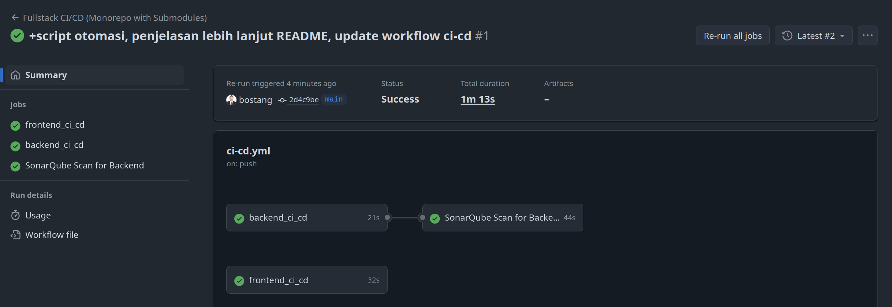

# Authentication App using Python (FastAPI) & React.js

Sebuah parent repository untuk aplikasi sederhana (frontend + backend) untuk autentikasi (register + login) menggunakan React.js untuk frontend dan juga Python FastAPI untuk backend.

## CARA CEPAT MENJALANKAN DI Minikube (k8s)

```bash
minikube start                                    # 0. nyalakan minikube

# pindah ke folder /k8s/
minikube kubectl -- create namespace auth-app     # 1. buat namespace
minikube kubectl -- apply -f . -n auth-app        # 2. terapkan manifest
minikube service frontend-service -n auth-app     # 3. akses url frontend
```

## CATATAN DETAIL penggunaan di Minikube (k8s)

```bash
# langkah 0 : make sure minikube sudah ada
minikube version    # cek versi (kalau ada, berarti sdh terinstall)
minikube start      # memulai service minikube 
minikube status     # pastikan sudah Running

# buat namespace baru
minikube kubectl -- create namespace auth-app

# pastikan sekarang sedang berada di direktori `/k8s/`
minikube kubectl -- apply -f . -n auth-app
# ekuivalen dengan satu per satu:
  # minikube kubectl -- apply -f app-secrets.yaml -n auth-app         # apply secrets
  # minikube kubectl -- apply -f db.yaml -n auth-app                  # apply db
  # minikube kubectl -- apply -f backend.yaml -n auth-app             # apply be
  # minikube kubectl -- apply -f frontend.yaml -n auth-app            # apply fe
  # minikube kubectl -- apply -f ingress.yaml -n auth-app             # ingress

# lihat pods & services yg terbentuk
minikube kubectl -- get services -n auth-app
minikube kubectl -- get pods -n auth-app -w     # `ctrl + C` saat semua sdh running & ready (butuh ~10s)

# akses service frontend
minikube service frontend-service -n auth-app

# DEBUGGING : LIHAT LOG
# pertama lihat nama pods :
# minikube kubectl -- get pods -n auth-app
minikube kubectl -- logs [nama_deployment]
  minikube kubectl -- logs  backend-deployment-54d7cb4d99-sq6gq -n auth-app

# memberhentikan pods
minikube kubectl -- delete -f .     # pastikan sedang di dalam direktori `/k8s/`

# DEBUGGING : AKSES PODS
minikube kubectl -- exec -it [nama-deployment] -n auth-app -- [COMMAND]
# contoh:
  # minikube kubectl -- exec -it "postgres-deployment-595d585996-69x85" -n auth-app -- psql -U postgres
  # minikube kubectl -- exec -it "backend-deployment-54d7cb4d99-sq6gq" -n auth-app -- /bin/bash

# atau bisa scr/ mudah lewat dasboard
minikube dashboard

# JIKA INGIN HAPUS TOTAL (BERSIHKAN NAMESPACE auth-app)
minikube kubectl --  delete all --all -n auth-app
minikube kubectl --  delete pvc postgres-pvc -n auth-app
```

Tentang **_Ingress Controller_** dapat dibaca di : `INGRESS.md`

**debugging**: memastikan konfigurasi Nginx yang benar benar-benar ada di dalam pod frontend

```bash
# Dapatkan nama pod frontend 
minikube kubectl -- get pods -n auth-app -l app=frontend -o jsonpath='{.items[0].metadata.name}'
# contoh output : 
  # frontend-deployment-66f665c76d-lp4dm

# LIHAT KONFIGURASI NGINX
minikube kubectl -- exec -it nama_pod_frontend -n auth-app -- cat /etc/nginx/conf.d/default.conf
# contoh :
  # minikube kubectl -- exec -it frontend-deployment-66f665c76d-lp4dm -n auth-app -- cat /etc/nginx/conf.d/default.conf

# PING DARI FE ke BE
minikube kubectl -- exec -it nama_pod_frontend -n auth-app -- ping -c 3 backend-service
# contoh:
  # minikube kubectl -- exec -it frontend-deployment-66f665c76d-lp4dm -n auth-app -- ping -c 3 backend-service

# CURL
minikube kubectl -- exec -it nama_pod_frontend -n auth-app -- curl -v http://backend-service:8000/api/auth/register
# contoh :
  # minikube kubectl -- exec -it frontend-deployment-66f665c76d-lp4dm -n auth-app -- curl -v http://backend-service:8000/api/auth/register
```

## Catatan Develop Agar bisa Deploy di Minikube

**Catatan 1**. Pastikan di kode (baik `frontend` maupun `backend`) tidak ada lagi `localhost:xxxx`. Semua sudah harus mengambil nilai dari **_environtment variables_**

contoh di backend (python):

```py
# Konfigurasi CORS
cors_origins_str = os.getenv("CORS_ORIGINS", "")
origins = [origin.strip() for origin in cors_origins_str.split(',') if origin.strip()]
```

contoh di frontend (react.js):

```js
const API_BASE_PATH = '/api'; // Base path for all API calls, handled by Nginx proxy
const API_AUTH_URL = `${API_BASE_PATH}/auth`; // Untuk endpoint /api/auth/register dan /api/auth/login

// ...
// register
// Menggunakan API_AUTH_URL yang sudah diperbarui
const response = await fetch(`${API_AUTH_URL}/login`, {
  method: 'POST',
  headers: {
    'Content-Type': 'application/json',
  },
  body: JSON.stringify({ username, password }),
});

// ...
```

**Catatan 2**. Pastikan konfigurasi `nginx.conf` sudah benar sebelum build image `frontend`.

> isi lengkap lihat di `/nginx/conf`

```conf
    upstream backend_app {
        server backend-service:8000; # <--- nama service Kubernetes
    }

    server {
        listen 80; # Nginx mendengarkan di port 80

      ; ...

        # Proxy API requests to the backend
        location /api/ {
            proxy_pass http://backend_app;
            proxy_set_header Host $host;
            proxy_set_header X-Real-IP $remote_addr;
            proxy_set_header X-Forwarded-For $proxy_add_x_forwarded_for;
            proxy_set_header X-Forwarded-Proto $scheme;
        }

      ; ...
    }
```

**Catatan 3** : Pastikan **_environment variables_** sudah dinyatakan di manifest

> isi lengkap lihat di `/k8s/`

```yml
# ...
env:
  - name: DB_USER
    valueFrom:
      secretKeyRef:
        name: app-secrets
        key: DB_USER
  - name: DB_PASSWORD
    valueFrom:
      secretKeyRef:
        name: app-secrets
        key: DB_PASSWORD
  - name: DB_NAME
    valueFrom:
      secretKeyRef:
        name: app-secrets
        key: DB_NAME
  - name: DB_HOST
    value: "postgres-service"
  - name: DB_PORT
    value: "5432"
```

**Catatan 4** : Buat **_Ingress controller_** dengan buat `ingress.yml`

## Cara Menjalankan (local)

### Otomatis

> script untuk instalasi aplikasi (frontend, backend) yaitu `init.sh` dan menjalankan aplikasi secara otomatis `run.sh` telah disipakan.

```bash
# lakukan sekali saja untuk menginstall library & dependency frontend dan backend
./init.sh

# untuk menjalankan aplikasi
./run.sh

# akses frontend
```

### Manual

- **Backend**
  - pindah ke direktori `python-fast-api-auth`
  - lakukan `pip install -r requirements.txt`
  - lakukan `uvicorn main:app --reload`
- **Frontend**
  - pindah ke direktori `react-frontend-auth`
  - lakukan `npm install`
  - lakukan `npm start`

## Penggunaan di Docker Compose

**Langkah 1** : Migrasi DB

> lakukan langkah ini SEKALI SAJA

```bash
# Bangun layanan terlebih dahulu (jika belum)
docker-compose build

# Jalankan kontainer db dan backend untuk sementara (tanpa frontend)
docker-compose up -d db backend

# Jalankan perintah migrasi di dalam kontainer backend
# Pastikan nama layanan backend Anda adalah 'backend'
docker-compose exec backend alembic upgrade head
  # contoh output:
    # INFO  [alembic.runtime.migration] Context impl PostgresqlImpl.
    # INFO  [alembic.runtime.migration] Will assume transactional DDL.
    # INFO  [alembic.runtime.migration] Running upgrade  -> 7a7a3b1ab18f, Create users table

# Hentikan dan hapus kontainer sementara
docker-compose down
```

**Langkah 2** : jalankan semua layanan

```bash
docker-compose up --build
```

### Catatan untuk Debug/Verifikasi

```bash
# untuk memastikan bahwa setelah register data sudah masuk, bisa cek log backend dan juga lihat langsung di database
docker ps

docker exec -it <<CONTAINER_ID_POSTGRESQL>> 
```

## Demonstrasi

- register :


- login:


- dashboard setelah login


- tampilan log di backend:


## Menambahkan submodul

> lakukan ketika belum ada `.gitmodules`

```bash
# menambahkan submodul frontend
git submodule add https://github.com/bostang/react-frontend-auth.git react-frontend-auth

# menambahkan submodul backend
git submodule add https://github.com/bostang/python-fast-api-auth.git python-fast-api-auth

# untuk memperbarui submodul apabila ada perubahan
git submodule update --init --recursive
```

## Catatan CI/CD Pipeline

Agar bisa melakukan CI/CD pipeline secara otomatis pada github workflow, pastikan _repository secrets_ telah didefiniskan tidak hanya di _child repo_ (`python-fast-api-auth`), tetapi juga _parent repo_ (`auth-app-python-react`).



mengingat variabel-variabel akan berbeda untuk _environment_ yang berbeda, misal saat `development` di local, kita punya URL :`http://localhost:8080`, tetapi saat deployment di kubernetes (`production`), kita punya : `http://backend-service:8080` ; maka agar github workflow berjalan sukses, kita bisa sesuaikan di `repository variables`.


lalu jangan lupa sertakan juga pada `ci-cd.yml`

```yml
env:
  DB_PASSWORD: ${{ vars.DB_PASSWORD }} # Mengakses variabel repositori
  DB_HOST: ${{ vars.DB_HOST }}
  DB_PORT: ${{ vars.DB_PORT }}
  DB_NAME: ${{ vars.DB_NAME }}
  DB_USER: ${{ vars.DB_USER }}
```

tampilan CI-CD sukses:



## Tutorial Singkat Push Docker image ke registry (Dockerhub)

```bash
# login ke docker
docker login

# lihat image yang sudah dibangun
docker images

# tag docker image
docker tag auth-app-python-react-backend bostang/auth-app-backend:latest
docker tag auth-app-python-react-frontend bostang/auth-app-frontend:latest

# push ke registry
docker push bostang/auth-app-backend:latest
docker push bostang/auth-app-frontend:latest
```

Cara orang lain menggunakan docker image kita:

```bash
# pastikan sudah memiliki docker-compose.yml
docker compose pull # Untuk mengunduh image terbaru
docker compose up -d # Untuk menjalankan kontainer di background
```
